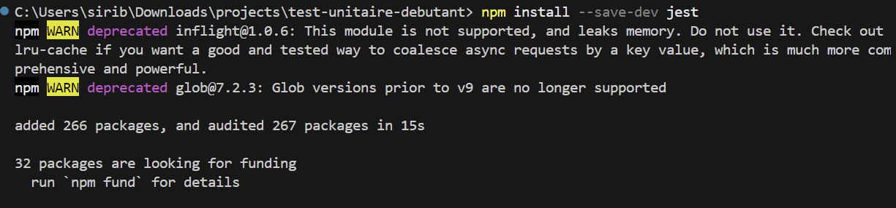
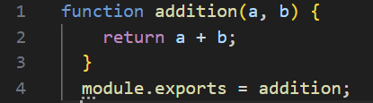
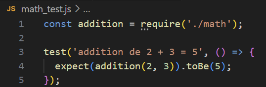
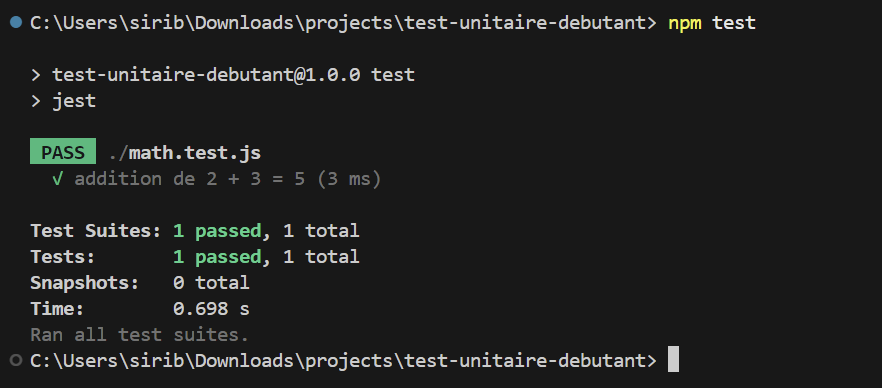
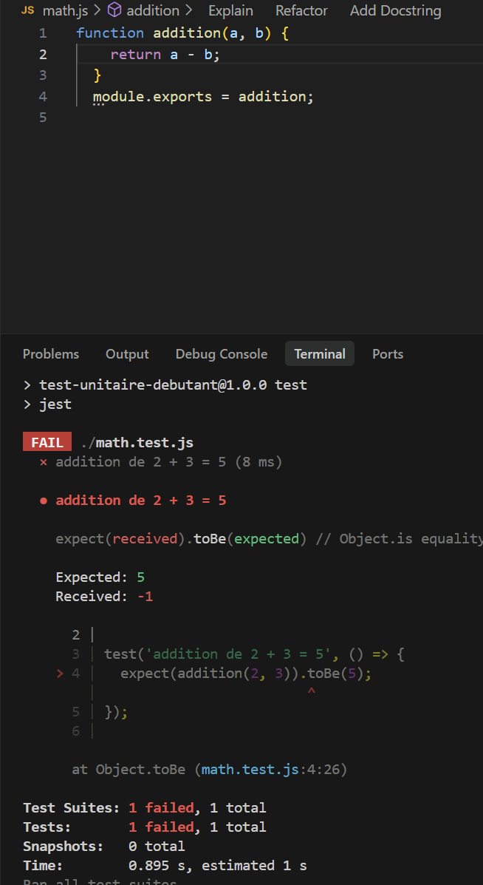

# Test Unitaire Débutant

## Étape 1 - Initialisation

Description : Création du projet Node.js...

## Étape 2 - Installation de Jest

Description : Installation de Jest avec npm...

## Étape 3 - Création du fichier math.js

Description : Création du fichier math.js...

## Étape 4 - Création du fichier math.test.js

Description : Création du fichier math.test.js...

## Étape 5 - Exécution des tests

Description : Exécution des tests avec Jest...

## Étape finale - Tests réussis ✅

