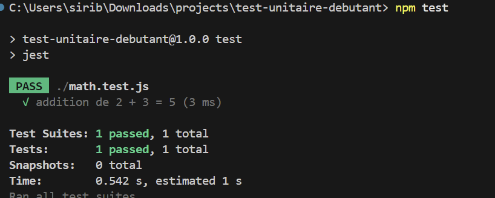
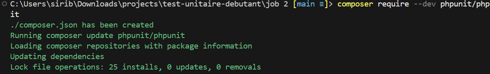
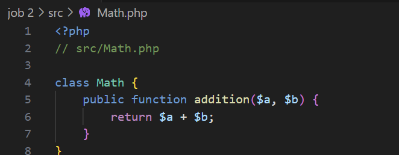
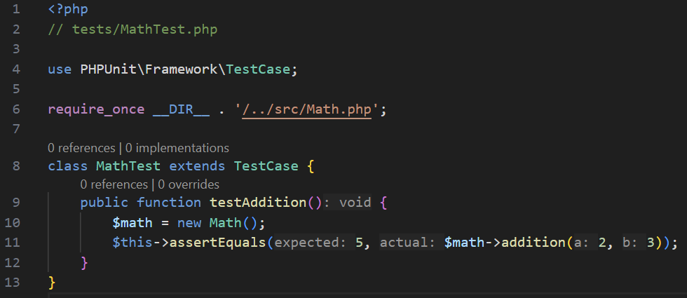
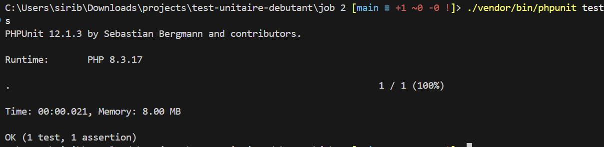
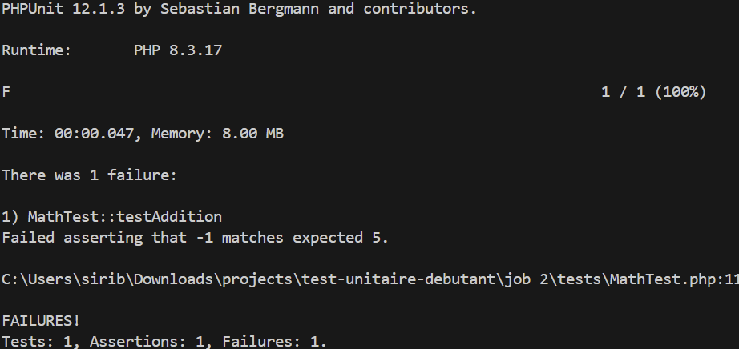

# Test Unitaire PHP Débutant

## Introduction

Projet d'apprentissage des tests unitaires en PHP avec PHPUnit.

---

## Étape 1 : Initialisation du projet

Création du dossier `test-unitaire-php-debutant`, initialisation avec Composer.

---

## Étape 2 - Installation de PHPUnit

Installation de PHPUnit en dev dependency avec Composer.

---

## Étape 3 - Création du fichier Math.php

Description : Création du fichier Math.php...

## Étape 4 - Création du fichier MathTest.php

Description : Création du fichier MathTest.php...

## Étape 5 - Exécution des tests

Description : Exécution des tests avec PHPUnit...

## Étape finale - Tests réussis ✅

